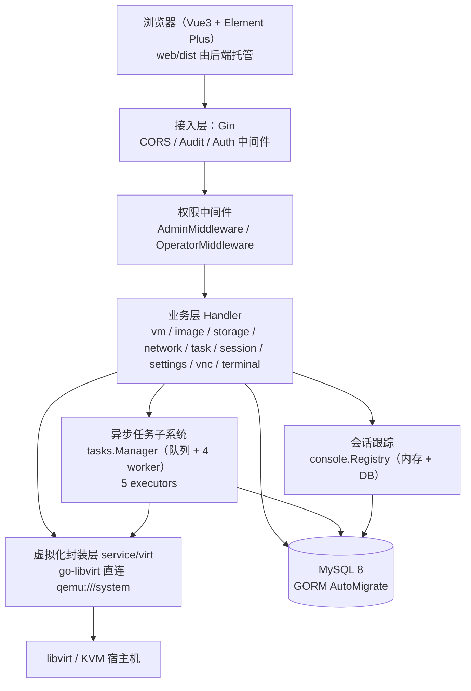
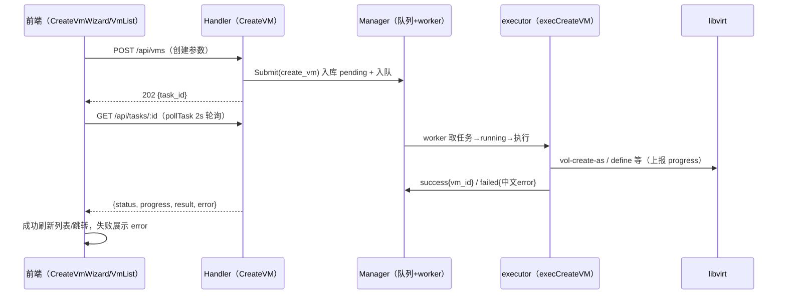

# 系统总体设计

> 对应论文章节：第四章 总体设计。
> 素材来源：旧《系统架构与总体设计》、旧《Go重构规划》项目架构、main.go 路由注册、docs/api-contract.md、docs/task-contract.md。

[TOC]

------

## 1. 系统架构

系统采用经典四层架构，前后端分离、单后端二进制交付：

分层说明如下：

| 层 | 组成 | 职责 |
|---|---|---|
| 前端层 | `web/src`（views / api / router / utils），构建产物 `web/dist` | 页面渲染、轮询（任务/会话/性能）、token 管理、统一响应解包 |
| 接入层 | Gin + `middleware`（`CORSMiddleware`、`AuditMiddleware`、`AuthMiddleware`） | 跨域、审计旁路、JWT 鉴权（支持 `?token=` 供 WS 使用） |
| 权限层 | `middleware/jwt.go`：`AdminMiddleware`、`OperatorMiddleware` | RBAC：admin 全放行；viewer 只读 + 控制台查看 |
| 业务层 | `handler/*` 直连 GORM；耗时操作委托 `service/tasks` | 同步接口直接返回；创建/删除/克隆/优雅关机提交异步任务后返回 202 |
| 异步任务子系统 | `service/tasks/manager.go`（`Manager`：队列 + worker 池）+ `service/tasks/vm_tasks.go`（5 executors） | 后台执行耗时虚拟化操作，上报 `progress`，回写 `success/failed` |
| 会话跟踪 | `service/console/registry.go`（`Registry`） | VNC/SSH/串口三链路建会话记录；SSH/串口持有 WS 以便强制断开；VNC 靠 token 解析刷新 + 过期清扫收敛 |
| 虚拟化封装层 | `service/virt/*`，`getConn()` 探活、`%w` 错误包装 | 所有 libvirt 调用唯一出口；状态经 `StateToPlatform` 映射；注释注明 virsh 等价命令 |
| 存储层 | MySQL 8（`database.Init()` AutoMigrate 7 张表） | `users / hosts / vms / images / audit_logs / tasks / console_sessions` |

## 2. 功能模块划分

| 模块 | 职责 | 关键文件 |
|---|---|---|
| 认证授权 | 登录（bcrypt + JWT 签发）、鉴权、RBAC 只读角色 | `handler/auth.go`、`middleware/jwt.go`（`AuthMiddleware`、`AdminMiddleware`、`OperatorMiddleware`） |
| 宿主机管理 | CRUD、连通性测试、实时状态采集 | `handler/host.go` |
| 虚拟机生命周期 | 列表/详情（状态同步）、启停/重启/暂停恢复、XML 查看编辑、纳管导入 | `handler/vm.go`、`service/virt/domain.go`、`service/virt/import.go` |
| 异步任务子系统 | 任务队列 + worker 池；创建/删除/克隆/优雅关机后台化；`202 + {task_id}` + 前端轮询 | `service/tasks/manager.go`（`Manager/NewManager/Submit/Get/List/Register`）、`service/tasks/vm_tasks.go`（`RegisterVMTasks` + 5 executors）、`handler/task.go`（`TaskHandler/ListTasks/GetTask/DeleteTask`）、`web/src/utils/task.js`（`pollTask`）、`web/src/views/TaskList.vue` |
| 会话跟踪与控制台 | VNC token 签发/解析、SSH/串口 WS 桥、三链路会话埋点、强制断开、过期清扫 | `service/console/registry.go`（`Registry/Open/OpenVNC/TouchByToken/Close/Disconnect/StartSweeper`）、`handler/session.go`（`SessionHandler/ListSessions/DisconnectSession`）、`handler/vnc.go`（`VNCHandler/RequestToken/ResolveToken`）、`handler/terminal.go`（`Connect`）、`service/vnc/token.go`（`TokenStore/Generate/Lookup`）、`web/src/views/SessionList.vue`、`web/src/views/ConsolePage.vue` |
| 镜像管理 | 上传（池卷落盘）、模板标记、基于镜像 linked clone 建机 | `handler/image.go`（`UploadImage/SetImageTemplate/CloneVM`） |
| 克隆与 cloud-init | linked clone（`vol-clone` 语义）、seed ISO 生成（纯 Go iso9660） | `service/virt/clone.go`（`CloneVolumeFromVol/CloneVMFromSpec/LookupVolByPath`）、`service/virt/cloudinit.go`（`GenerateSeedISO`） |
| 硬件管理 | 磁盘/网卡热插拔、调核/调内存、autostart、引导顺序、spec 重定义 | `service/virt/device.go`（`AttachDisk/DetachDisk/AttachInterface/DetachInterface/SetVcpus/SetMemory`）、`service/virt/spec.go`（`GetDomainSpec/ParseDomainXML/BuildDomainXML/NextDiskTarget`）、`web/src/views/VmDetail.vue` |
| 存储池管理 | 池列表/详情、新建目录池、卷创建/删除 | `service/virt/storage.go`、`handler/storage.go` |
| 网络管理 | 网络列表/详情、启停/删除、NAT 创建、XML 编辑 | `service/virt/network.go`、`handler/network.go` |
| 快照管理 | 创建（带描述）/列表/删除/回滚 | `service/virt/snapshot.go`（`CreateSnapshot/ListSnapshots`） |
| 网页控制台 | noVNC 图形控制台、Web 终端（SSH）、串口 Console | 见“会话跟踪与控制台”行 |
| 审计日志 | `AuditMiddleware` 自动写入，多条件筛选与分布统计 | `middleware/audit.go`、`handler/audit.go` |
| 仪表盘 | 平台总览、VM 状态分布、主机实时、VM 性能 | `handler/dashboard.go`（`Overview/VMStatusDistribution/HostStats/VmPerf`） |
| 系统设置 | 生效配置快照只读展示 + 前端轮询偏好（localStorage） | `handler/settings.go`（`SettingsHandler/GetSettings`）、`web/src/views/Settings.vue` |
| 任务中心页 / 会话管理页 | 任务列表轮询 + 清理已完成；会话列表 + 强制断开 | `web/src/views/TaskList.vue`、`web/src/views/SessionList.vue` |
| 创建向导 | 分步创建（ISO/云镜像/克隆），提交后轮询任务 | `web/src/views/CreateVmWizard.vue` |

路由与中间件装配（`main.go`）：公开 `POST /api/auth/login` 与 `GET /api/vnc/token/:token`（供 websockify 内网解析）；`/api` 组统一经过 `AuthMiddleware`，各资源组按敏感度挂 `AdminMiddleware`（`/users`、`/audit`、`/settings`）或 `OperatorMiddleware`（`/hosts`、`/vms`、`/storage`、`/networks`、`/images`、`/dashboard`、`/tasks`、`/sessions`）。单例装配：`taskMgr := tasks.NewManager(db)` + `tasks.RegisterVMTasks(taskMgr)`，`consoleRegistry := console.NewRegistry(db)` + `StartSweeper()`，注入各 Handler。

## 3. 典型请求流转

### 3.1 同步请求（以“查询 VM 详情”为例）

浏览器 → `AuthMiddleware`（验 JWT）→ `OperatorMiddleware`（viewer 允许 GET）→ `vmHandler.GetVMDetail` → `Virt.GetDomainSpec`（对应 `virsh dumpxml`）→ 状态同步回写 DB → 统一响应 `{code,message,data}`。

### 3.2 耗时操作走异步任务（202 + 轮询）

以“创建虚拟机”为例：

关键要点：

- 鉴权前置：JWT 验身份 + `OperatorMiddleware` 控角色，viewer 的变更请求在中间件层即 403。
- 异步化边界：`POST /api/vms`、`DELETE /api/vms/:id`、`POST /api/vms/:id/clone`、`POST /api/images/:id/clone`、`POST /api/vms/:id/stop` 五个耗时接口校验基础参数后 `Submit` 并返回 202；其余快接口保持同步。
- 进度可观测：executor 经 `ExecContext.Report` 回写 `tasks.progress`（如创建 10/30/50/70、优雅关机每秒上报），前端 `pollTask` 轮询 `GET /api/tasks/:id` 至 `success/failed`。
- 审计旁路：`AuditMiddleware` 与业务解耦记录操作；失败回滚：创建失败清理已建卷与 seed，删除按“先枚举磁盘清单再 undefine”顺序清理。
- 启动收敛：`main.go sweepStaleRecords` 将残留 `pending/running` 任务标 `failed`、残留 ssh/serial 会话标 `closed`，避免重启后幽灵任务与幽灵会话。

## 4. 关键设计点

| 设计点 | 说明 |
|---|---|
| 统一响应封装 | `{code,message,data}`；`handler/response.go` 提供 `Success/Fail/ErrorResponse/ErrorWithMessage`；handler 边界不泄漏内部错误 |
| 认证与授权分离 | JWT 验身份（`AuthMiddleware`，支持 WS `?token=`）+ 角色控权限（`AdminMiddleware` / `OperatorMiddleware`） |
| 只读 viewer 角色 | viewer 允许全部 GET 与 `POST /api/vms/:id/vnc-token`（图形查看）；其余 POST/PUT/DELETE 一律 403；`/users`、`/audit`、`/settings` 仅 admin |
| 耗时操作异步化 | 任务队列 + 4 worker；202 返回 `{task_id}`；前端 `pollTask`（2s 间隔）轮询至终态 |
| 操作审计可追溯 | 中间件自动写入 `audit_logs`，username 冗余，覆盖主要操作类型 |
| 会话可观测 | VNC/SSH/串口三链路埋点写 `console_sessions`；SSH/串口可服务端强制断开；VNC 靠解析刷新 + 60 分钟过期清扫收敛 |
| 真实虚拟化落地 | 非模拟数据；建盘走存储池/卷 API（对应 `virsh vol-create-as`），域管理走 Define/Create/Shutdown/Destroy 等 |
| 增量克隆 | `StorageVolCreateXMLFrom` 实现 linked clone（对应 `virsh vol-clone`），子卷带 backing file，父盘在子卷存续期间不可删 |
| 状态实时同步 | virsh 拉取回写 DB；VM 列表携带 `perf` 一次渲染，详情页 2s 轮询 `stats` |
| 前端静态托管 | 单二进制 + `web/dist`（`index.html` 启动时读入内存，改前端需 build + 重启） |

## 5. 部署形态

- 单后端二进制 + 前端静态产物（`web/dist`，缺失回退 `static/index.html`）。
- MySQL 8（本机或 Docker 容器 `vmops-mysql`）。
- 被纳管宿主机需 libvirt + KVM；运行用户需加入 `libvirt` 组。
- 网页控制台依赖 `websockify --web /usr/share/novnc --token-plugin JSONTokenApi --token-source http://127.0.0.1:8080/api/vnc/token/%s 6080`。

## 6. 设计原则

- 一条主线（平台本身）。
- 分时运行（VM 不常驻）。
- 受限硬件硬预算。
- 自研代码 = 论文工作量。
- 每个技术点可回答「为什么选它」（如：任务队列解决同步 Stop 15s 撞 axios 超时；seed 独立目录规避存储池目录权限；VNC 中转故会话只能收敛不能强断）。

---

## 📌 素材出处

- 旧《系统架构与总体设计》全文
- main.go 路由注册（handler 初始化、分组、静态托管、单例装配、sweepStaleRecords）
- docs/api-contract.md（virt 层与 REST 契约）、docs/task-contract.md（任务系统契约）
