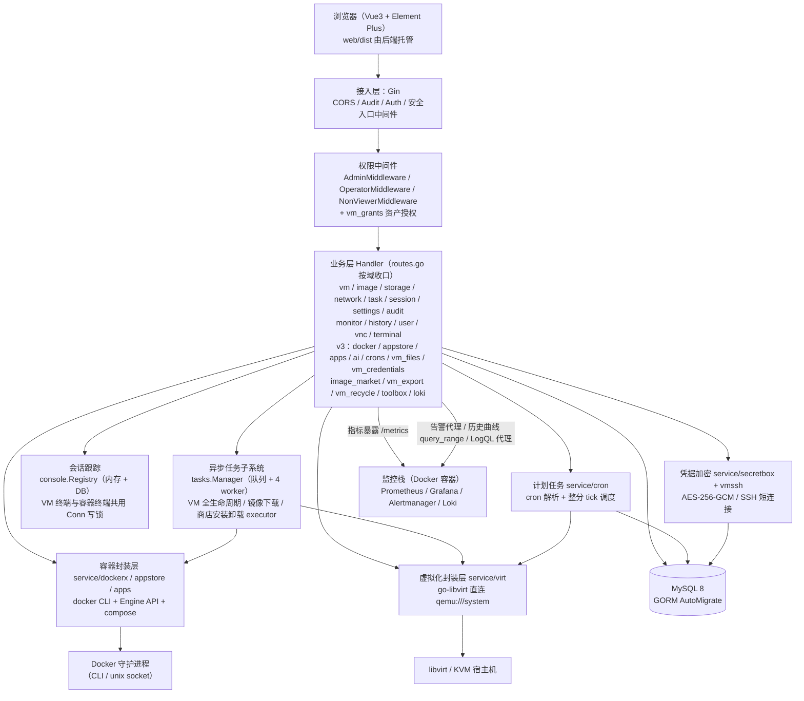
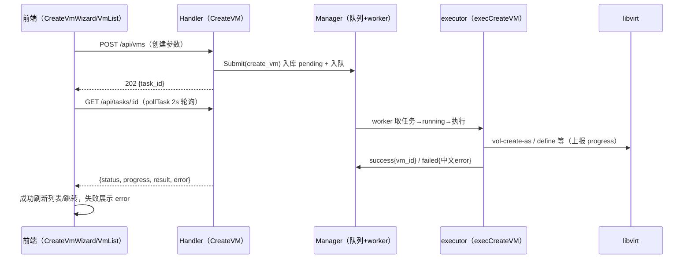

# 系统总体设计

> 对应论文章节：第四章 总体设计。
> 素材来源：旧《系统架构与总体设计》、旧《Go重构规划》项目架构、handler/routes.go 路由注册、docs/api-contract.md、docs/task-contract.md、docs/ROADMAP-v3*.md（v3 扩展批次）。

[TOC]

------

## 1. 系统架构

系统采用经典四层架构，前后端分离、单后端二进制交付：



分层说明如下：

| 层 | 组成 | 职责 |
|---|---|---|
| 前端层 | `web/src`（views / api / router / utils），构建产物 `web/dist` | 页面渲染、轮询（任务/会话/性能）、token 管理、统一响应解包 |
| 接入层 | Gin + `middleware`（`CORSMiddleware`、`AuditMiddleware`、`AuthMiddleware`、`EntranceMiddleware` 安全入口） | 跨域、审计旁路、JWT 鉴权（支持 `?token=` 供 WS 使用）、登录接口暗号门 |
| 权限层 | `middleware/jwt.go`：`AdminMiddleware`、`OperatorMiddleware`、`NonViewerMiddleware` + `vm_grants` 资产授权 | RBAC 三级角色（admin / operator / viewer）+ VM 资产授权「授权决定可见性」（详见 4.2 开头的四层闭环） |
| 业务层 | `handler/*` 直连 GORM；耗时操作委托 `service/tasks` | 同步接口直接返回；创建/删除/克隆/优雅关机/镜像下载/商店安装卸载提交异步任务后返回 202 |
| 异步任务子系统 | `service/tasks/manager.go`（`Manager`：队列 + worker 池）+ 各域 executor | 后台执行耗时虚拟化与应用交付操作，上报 `progress`，回写 `success/failed` |
| 会话跟踪 | `service/console/registry.go`（`Registry`）+ `conn.go`（`Conn`，写锁串行化 WS 写入） | VNC/SSH/串口/容器终端四链路建会话记录；SSH/串口/容器终端持有 `*Conn` 以便强制断开；VNC 靠 token 解析刷新 + 过期清扫收敛 |
| 虚拟化封装层 | `service/virt/*`，`getConn()` 探活、`%w` 错误包装 | 所有 libvirt 调用唯一出口；状态经 `StateToPlatform` 映射；注释注明 virsh 等价命令 |
| 容器封装层（v3） | `service/dockerx`（CLI/Engine API 封装）、`service/appstore`（声明式 compose 应用包）、`service/apps`（VM 内 SSH 脚本应用） | 所有 Docker 调用唯一出口；`exec.Command` 数组参数禁 shell 拼接、统一 30s 超时；见 §7 |
| 运维服务层（v3） | `service/cron`（计划任务）、`service/secretbox`（凭据加密）、`service/vmssh`（SSH 短连接）、`service/monitor`（file_sd）、`service/setting`（KV 设置） | 见 §7 |
| 存储层 | MySQL 8（`database.Init()` AutoMigrate 16 张表，连接池显式配置） | `users / hosts / vms / images / audit_logs / tasks / console_sessions / system_settings / alerts / pool_meta / vm_grants / vm_credentials / scheduled_tasks / cron_runs / cloud_init_templates / host_keys` |

## 2. 功能模块划分

| 模块 | 职责 | 关键文件 |
|---|---|---|
| 认证授权 | 登录（bcrypt + JWT 签发）、鉴权、RBAC 三级角色 | `handler/auth.go`、`middleware/jwt.go`（`AuthMiddleware`、`AdminMiddleware`、`OperatorMiddleware`、`NonViewerMiddleware`） |
| 宿主机管理 | CRUD、连通性测试、实时状态采集 | `handler/host.go` |
| 虚拟机生命周期 | 列表（含资产授权过滤）/详情（状态同步）、启停/重启/暂停恢复、XML 查看编辑、纳管导入、**授权管理（仅 admin）** | `handler/vm.go`（原单文件已拆分：`vm.go` / `vm_devices.go` / `vm_import.go` / `vm_xml.go` / `vm_snapshot.go` / `vm_grant.go`）、`service/virt/domain.go`、`service/virt/import.go` |
| 异步任务子系统 | 任务队列 + worker 池；创建/删除/克隆/优雅关机/孤儿卷清理后台化；真分页；`202 + {task_id}` + 前端轮询；建机/克隆自动授权发起人、删机回收授权 | `service/tasks/manager.go`（`Manager/NewManager/Submit/Get/ListPaged/Register`）、`service/tasks/vm_tasks.go`（`RegisterVMTasks` + 6 executors，executor 按域拆分至 `vm_create.go` / `vm_delete.go` / `vm_clone.go`，含 cleanup_volumes 孤儿卷清理）、`handler/task.go`（`TaskHandler/ListTasks/GetTask/DeleteTask`）、`web/src/utils/task.js`（`pollTask`）、`web/src/views/TaskList.vue` |
| 会话跟踪与控制台 | VNC token 签发/解析、SSH/串口 WS 桥、三链路会话埋点、强制断开、过期清扫、WS 写入串行化 | `service/console/registry.go`（`Registry/Open/OpenVNC/TouchByToken/Close/Disconnect/StartSweeper/sweepOnce`）、`service/console/conn.go`（`Conn/NewConn/WriteMessage/WriteJSON/ReadMessage/Close/CloseWithReason/ErrConnClosed`）、`handler/session.go`（`SessionHandler/ListSessions/DisconnectSession`）、`handler/vnc.go`（`VNCHandler/RequestToken/ResolveToken`）、`handler/terminal.go`（`Connect/validateSSHTarget`）、`service/vnc/token.go`（`TokenStore/Generate/Lookup`）、`web/src/views/SessionList.vue`、`web/src/views/ConsolePage.vue` |
| 镜像管理 | 上传（池卷落盘）、模板标记、基于镜像增量克隆建机 | `handler/image.go`（`UploadImage/SetImageTemplate/CloneVM`） |
| 克隆与 cloud-init | 增量克隆（qcow2 `<backingStore>` 语义）、backing 依赖枚举、seed ISO 生成（纯 Go iso9660） | `service/virt/clone.go`（`CloneVolumeFromVol/CloneVMFromSpec/buildCloneSpec/systemDiskIndex/randomMACAddr/LookupVolByPath`）、`service/virt/storage.go`（`buildVolumeXMLWithBacking/ListBackingRefs`）、`service/virt/cloudinit.go`（`GenerateSeedISO`） |
| 硬件管理 | 磁盘/网卡热插拔（含一键建盘挂载、补齐标准设备、分离可选删卷）、调核/调内存、autostart、spec 重定义 | `service/virt/device.go`（`AttachDisk/DetachDisk/AttachInterface/DetachInterface/SetVcpus/SetMemory/EnsureStandardDevices`）、`service/virt/spec.go / spec_parse.go / spec_build.go`（`GetDomainSpec/ParseDomainXML/BuildDomainXML/NextDiskTarget`）、`web/src/views/VmDetail.vue` |
| 存储池管理 | 池列表/详情、新建目录池、卷创建/删除、**删卷三重守卫（409）**、卷引用查询、**孤儿卷清理任务** | `service/virt/storage.go`（`ListBackingRefs`）、`service/virt/domain.go`（`ListAllDomainDiskSources`）、`handler/storage.go`（`DeleteVolume/GetVolumeRefs/CleanupOrphans`） |
| 监控中心 | Alertmanager 告警代理、webhook 告警网关与历史、file_sd 服务发现生成与预览、Grafana 双看板 kiosk 嵌入（含后端探活兜底）、历史性能曲线（query_range 回放） | `handler/monitor.go`、`handler/alert_webhook.go`、`handler/history.go`、`service/monitor`、`web/src/views/Monitor.vue` |
| 网络管理 | 网络列表/详情、启停/删除、NAT 创建、XML 编辑、自启动开关 | `service/virt/network.go`（`SetNetworkAutostart/ListDHCPLeases/ListGuestIPs`）、`handler/network.go` |
| 快照管理 | 创建（带描述）/列表/删除/回滚 | `service/virt/snapshot.go`（`CreateSnapshot/ListSnapshots`） |
| 网页控制台 | noVNC 图形控制台、Web 终端（SSH）、串口 Console | 见“会话跟踪与控制台”行 |
| 审计日志 | `AuditMiddleware` 自动写入，多条件筛选与分布统计 | `middleware/audit.go`、`handler/audit.go` |
| 仪表盘 | 概览/监控双 tab：平台总览、VM 状态分布、主机实时、VM 性能、资源容量/超分卡、告警概览卡 | `handler/dashboard.go`（`Overview/Capacity/VMStatusDistribution/HostStats/VmPerf`） |
| 系统设置 | 可写运行参数（system_settings KV 表，保存即生效）；只读快照由仪表盘「平台信息」卡承接 | `model/setting.go`、`service/setting/setting.go`（白名单校验+缓存）、`handler/settings.go`（`GetSettings/UpdateSettings`）、`web/src/views/Settings.vue` |
| 审计中心 | 操作日志 + 控制台会话双 tab（分角色可见性） | `web/src/views/AuditList.vue`、`web/src/views/SessionList.vue`、`handler/audit.go`、`handler/session.go` |
| 个人中心 | 个人资料、自助改密、界面轮询偏好（全角色） | `web/src/views/Profile.vue`、`handler/user.go`（`ChangeMyPassword`） |
| 用户管理 | 账号 CRUD、角色白名单、启停 | `handler/user.go`、`web/src/views/UserList.vue` |
| 任务中心页 | 任务列表（真分页）、详情抽屉（result 解析/kept_volumes） | `web/src/views/TaskList.vue`、`handler/task.go` |
| 创建向导 | 分步创建（ISO/云镜像/克隆），提交后轮询任务 | `web/src/views/CreateVmWizard.vue` |
| 容器管理（v3） | 容器/镜像/网络/卷/compose 编排五 tab、容器终端（WS↔Engine API exec TTY）、日志查看、资源统计、批量操作与清理；viewer 403 | `service/dockerx`（`Dockerx`，CLI `--format json` 结构化输出 + Engine API exec）、`handler/docker.go`、`handler/docker_compose.go`、`handler/container_terminal.go`、`web/src/views/DockerList.vue` |
| 应用商店（v3） | 声明式 compose 应用包（20 个内置应用）：动态表单渲染、安装前端口预检、异步安装/卸载（卸载保留数据） | `service/appstore`（`conf/appstore/<key>/<ver>/` 三件套 → `data/apps` + `.env` + `docker compose up -d`）、`handler/appstore.go`、`web/src/views/AppStore.vue` |
| VM 应用（v3） | SSH 脚本应用：经 `app_install` 任务在虚拟机内幂等执行（Detect 已装跳过） | `service/apps`（10 个内置应用）、`handler/apps.go` |
| AI 运维助手（v3） | OpenAI 兼容 API 代理（SSE 流式）、平台上下文注入、Key 服务端托管 | `handler/ai.go`、`web/src/views/AiChat.vue` |
| SSH 凭据托管（v3） | 凭据 AES-256-GCM 加密落库；文件管理/应用安装经后端解密消费 | `service/secretbox`、`service/vmssh`、`handler/vm_credentials.go`（`model.VMCredential`） |
| VM 文件管理（v3） | 在线 SSH/SFTP 通道（开机机）+ guestmount 离线只读挂载通道（关机机） | `handler/vm_files.go`、`handler/vm_files_offline.go` |
| 计划任务（v3） | 五字段 cron 解析 + 整分 tick 调度：定时快照 / mysqldump 备份；执行记录 | `service/cron`（`Scheduler` 自起协程整分 tick）、`handler/crons.go`、`model/scheduled_task.go`、`model/cron_run.go` |
| 回收站（v3） | 软删 VM 可视化恢复/彻底清除（admin） | `handler/vm_recycle.go`、`web/src/views/RecycleBin.vue` |
| 镜像市场（v3） | 官方云镜像清单一键下载（异步任务 + 镜像库自动登记），镜像管理页第三 tab | `handler/image_market.go`、`service/tasks`（`image_download` executor）、`web/src/views/ImageList.vue`（内嵌 `ImageMarket.vue`） |
| VM 导出/导入（v3） | tar.gz 全量包（域 XML + 系统盘）流式导出/导入 | `handler/vm_export.go` |
| 运维增强（v3） | 工具箱（进程/磁盘/Docker 清理/任务清理，admin）、cloud-init 模板 CRUD、系统公告（公开读）、拓扑图 | `handler/toolbox.go`、`handler/cloud_init_templates.go`、`handler/announcement.go`、`web/src/views/{Toolbox,CloudInitTemplates,Topology}.vue` |
| 安全入口与密码策略（v3） | 登录暗号门（无暗号 404 伪装）、密码复杂度校验 | `middleware/entrance.go`、`handler/auth.go`、`handler/user.go` |

路由与中间件装配（`handler/routes.go` 按域收口，main.go 只留 `RegisterAll` 一行）：公开 `POST /api/auth/login`（可挂安全入口暗号门）、`GET /api/announcement`（公告公开读）、`GET /api/vnc/token/:token`（供 websockify 内网解析）、`POST /api/monitor/webhook`（Alertmanager 告警网关）与 `GET /metrics`；`/api` 组统一经过 `AuthMiddleware`，各资源组按敏感度挂 `AdminMiddleware`（`/users`、`/audit`、`/settings`、v3 的 `/crons`、`/vms-recycle`、`/toolbox`）、`OperatorMiddleware`（`/hosts`、`/vms`、`/storage`、`/networks`、`/images`、`/dashboard`、`/tasks`、`/sessions`、v3 的 `/apps`（目录浏览）、`/cloud-init-templates`）或 `NonViewerMiddleware`（`/monitor` 含 v3 Loki 日志、`/docker`、`/appstore`、`/ai`——容器清单、应用目录与 AI 上下文同告警一样携带资产信息，viewer 403）。operator 的写操作被收敛在 `/api/vms` 前缀内（虚拟机全生命周期，含三类控制台），基础设施模块只读；v3 的商店安装（`POST /vms/apps/install`）与文件管理（`/vms/:id/files/*`）刻意挂在 `/vms` 前缀内让 operator 放行——「往自己的虚拟机装软件、传文件」属操作语义。授权管理三端点（`/api/vms/:id/grants`）与回收站、工具箱等敏感 handler 内再以 `requireAdminRole` 二次收口（纵深防御，路由误挂仍拦得住）；非 admin 对 VM 的读访问经 `vmVisible`/`grantedVMIDs` 按 `vm_grants` 未过期授权过滤，未授权返回 404。单例装配：`taskMgr := tasks.NewManager(db)` + 域 executor 注册，`consoleRegistry := console.NewRegistry(db)` + `StartSweeper()`，`cronScheduler` 整分 tick 自起协程，统一注入 `handler.Deps` 后由各 `RegisterXxxRoutes` 构造。

## 3. 典型请求流转

### 3.1 同步请求（以“查询 VM 详情”为例）

浏览器 → `AuthMiddleware`（验 JWT）→ `OperatorMiddleware`（viewer 允许 GET）→ 资产授权判定（`vmVisible`：非 admin 校验 `vm_grants` 未过期授权，未授权 404 查无此项）→ `vmHandler.GetVMSpec` → `Virt.GetDomainSpec`（对应 `virsh dumpxml`）→ 状态同步回写 DB → 统一响应 `{code,message,data}`。

### 3.2 耗时操作走异步任务（202 + 轮询）

以“创建虚拟机”为例：



关键要点：

- 鉴权前置：JWT 验身份 + `OperatorMiddleware` 控角色，viewer 的变更请求与 SSH/串口通道在中间件层即 403；非 admin 对 VM 的访问还须过资产授权判定（`vmVisible`，未授权 404）。
- 参数前置校验：带 `:id` 的接口先由 `paramID` 把路径参数解析为 `uint`，非法值返回 400「ID 参数非法」，不进入数据库查询。
- 异步化边界：`POST /api/vms`、`DELETE /api/vms/:id`、`POST /api/vms/:id/clone`、`POST /api/images/:id/clone`、`POST /api/vms/:id/stop` 五个耗时接口校验基础参数后 `Submit` 并返回 202；其余快接口保持同步。
- 进度可观测：executor 经 `ExecContext.Report` 回写 `tasks.progress`（如创建 10/30/50/70、优雅关机每秒上报），前端 `pollTask` 轮询 `GET /api/tasks/:id` 至 `success/failed`。
- 失败可观测：executor 返回错误或发生 panic 时，原始错误链与调用栈只进服务端日志，`tasks.error` 只存中文友好文案（panic 对应「任务执行异常，请查看服务日志」，入队超时对应「任务队列繁忙，请稍后重试」）。
- 审计旁路：`AuditMiddleware` 与业务解耦记录操作；失败回滚：创建失败清理已建卷与 seed，删除按“先枚举磁盘清单再 undefine”顺序清理，且每个卷在删除前须通过三重守卫（见 4.3）。
- 启动收敛：`main.go sweepStaleRecords` 将残留 `pending/running` 任务标 `failed`、残留 ssh/serial 会话标 `closed`，避免重启后幽灵任务与幽灵会话。

## 4. 关键设计点

| 设计点 | 说明 |
|---|---|
| 统一响应封装 | `{code,message,data}`；`handler/response.go` 提供 `Success/Fail/ErrorResponse/ErrorWithMessage`，`middleware` 侧对应 `abortJSON`（不能反向引用 handler，否则构成导入环）；handler 边界不泄漏内部错误 |
| 认证与授权分离 | JWT 验身份（`AuthMiddleware`，支持 WS `?token=`，验签锁定 HS256）+ 角色控权限（`AdminMiddleware` / `OperatorMiddleware` / `NonViewerMiddleware`） |
| 三级角色 RBAC | admin 全量；operator 可操作虚拟机全生命周期（`/api/vms` 前缀内写操作 + 三类控制台），基础设施（宿主机/存储/网络/镜像）只读，用户/审计/设置不可达；viewer 完全只读——SSH 终端与串口虽为 GET 但属 guest 写入通道，403，图形控制台附 `view_only` 标记；监控中心四端点（告警/历史/file-sd/Grafana 探活）viewer 403（告警 labels 与 file-sd 目标携带全部运行中 VM 的名称与 IP，属资产名单） |
| VM 资产授权（借鉴 JumpServer 4A） | 授权是一等实体：`vm_grants` 表（user_id × vm_id 唯一，`expires_at` 可空 = 长期有效，过期在查询判定时即时失效）；核心语义「**授权决定可见性**」——非 admin 对任何 VM 的访问（列表/详情/规格/克隆源/快照/三控制台/历史曲线）都要求未过期授权，未授权一律 **404 查无此项**（不泄露存在性）；admin 不受约束；建机/克隆任务自动授权发起人，删 VM 回收授权；授权管理 API 仅 admin（handler 内 `requireAdminRole` 二次收口）。刻意取舍：不做 用户组×资产树×账号×动作 四维矩阵，单宿主机场景一张平面表足够 |
| 主键参数统一解析 | 路径参数 `:id` 经 `handler/param.go` 的 `paramID`/`parseID` 解析为 `uint` 后才进入 GORM，避免内联条件退化为原始 SQL 片段；非法 ID 在进库前返回 400 |
| 输入到解释器的边界收敛 | libvirt XML 一律由 `encoding/xml` 结构体序列化；外部进程 argv、出站 SSH 目标、存储路径与网关均在接口层限制取值域 |
| 耗时操作异步化 | 任务队列 + 4 worker；202 返回 `{task_id}`；前端 `pollTask`（2s 间隔）轮询至终态；入队有界（队列满最多等 3s 后置 failed） |
| 进程级容错 | WebSocket 写入经 `console.Conn` 写锁串行化；后台 worker / 清扫器 / WS 转发协程各自 `defer recover()`（Web 框架的 Recovery 不覆盖自起 goroutine） |
| 操作审计可追溯 | 中间件自动写入 `audit_logs`，username 冗余，覆盖主要操作类型；静态资源、健康检查、`/metrics` 与 SPA 路由回退不入表 |
| 会话可观测 | VNC/SSH/串口三链路埋点写 `console_sessions`；SSH/串口可服务端强制断开；VNC 靠解析刷新 + 60 分钟过期清扫收敛 |
| 真实虚拟化落地 | 非模拟数据；建盘走存储池/卷 API（对应 `virsh vol-create-as`），域管理走 Define/Create/Shutdown/Destroy 等 |
| 增量克隆 | 子卷 XML 声明 `<backingStore>` 指向父盘（`StorageVolCreateXML`，等价 `qemu-img create -f qcow2 -F qcow2 -b`），qcow2 写时复制；克隆机 UUID 与全部网卡 MAC 重新生成；父盘在子卷存续期间不可删/移动/改写 |
| 删除的破坏性收敛 | 删卷前过三重守卫（池外文件 / 镜像库登记的共享基镜像 / 仍被子卷当 backing file 的父盘），命中即保留并把中文原因写进任务结果 `kept_volumes` 与日志；宁留孤儿文件，不损坏在用磁盘 |
| 状态实时同步 | virsh 拉取回写 DB；VM 列表携带 `perf` 一次渲染，详情页 2s 轮询 `stats` |
| 前端静态托管 | 单二进制 + `web/dist`（`index.html` 启动时读入内存，改前端需 build + 重启）；按四候选目录探测，缺失时降级为「仅 API」 |

## 4.1 并发与可靠性设计

平台有三类脱离 HTTP 请求链的执行流，其异常无法被 Web 框架的 Recovery 中间件捕获，
一次未处理的 panic 会直接终止整个进程，连带所有虚拟机的控制台会话与在途任务：

| 执行流 | 位置 | 并发写入方 | 兜底手段 |
|---|---|---|---|
| 任务 worker（4 个） | `service/tasks/manager.go` | — | `runExecutor` 兜 executor panic，`run` 顶层再兜 DB/JSON 等裸奔点，`markFailed` 自带 recover |
| 会话清扫器（每 5 分钟） | `service/console/registry.go` | — | `sweepOnce` 自带 recover，单轮失败不终止定时循环 |
| WebSocket 桥接协程 | `handler/terminal.go`、`handler/serial.go` | SSH 桥 3 路 + 串口桥 2 路 + 强制断开 1 路 | 各协程 `defer recover()`；写入统一经 `console.Conn` |

WebSocket 连接的写入串行化由 `service/console/conn.go` 的 `Conn` 类型承担。所用库
（gorilla/websocket）允许「一个读协程 + 一个写协程」并发，但明确禁止多个协程同时写，
违反即 panic。而本系统的 SSH 桥存在 stdout 转发、stderr 转发、主循环错误帧三路写，
串口桥存在客户机输出转发与错误帧两路写，再加上会话注册表在管理员强制断开时发送的关闭帧，
最多四路写入同一连接。`Conn` 以写锁串行化 `WriteMessage`/`WriteJSON`/`CloseWithReason`，
关闭后写入返回 `ErrConnClosed` 供桥接协程退出循环，`Close` 幂等；读侧由单一协程独占故不加锁。

任务队列的背压处理同样影响进程稳定性。原实现在队列满时另起协程阻塞入队，协程数量随提交
频率无上限增长且永不退出；现改为在调用方（handler 自身的请求协程，本就存在且由连接数天然
限流）上等待至多 3 秒，超时即把任务置为失败并回写中文原因，协程数量零增长，同时把背压如实
传回客户端。

会话清扫器原先在持有内存锁的同时逐条查库，锁的持有时间与数据库往返次数成正比，会阻塞所有
会话的开启与关闭；现改为「锁内取快照 → 锁外查库 → 回锁删除并二次确认映射未被重新签发覆盖」。

## 4.2 安全设计

平台的安全控制按「**认证 → 三级角色 → 资产授权 → 操作审计**」四层闭环组织：
① `AuthMiddleware` 验明身份（JWT，验签锁定 HS256）；② `AdminMiddleware` / `OperatorMiddleware` /
`NonViewerMiddleware` 按 admin / operator / viewer 三级角色收敛各路由组的可达面（operator 的写
被收敛在 `/api/vms` 前缀内，viewer 对资产名单类端点直接 403）；③ VM 资产授权按「授权决定可见性」
再收敛单个用户可见、可操作的虚拟机集合（未授权 404，见 §4 表）；④ `AuditMiddleware` 旁路记录
全部操作形成追溯。四层是逐级过滤关系，前一层放行的请求才进入后一层，任何一层拒绝都不会触碰
业务 handler。

安全设计以「攻击者可控输入 → 该输入最终抵达的解释器」为线索组织，每类输入在进入解释器前收敛取值域：

| 解释器 | 可控输入 | 收敛手段 | 位置 |
|---|---|---|---|
| SQL（GORM 内联条件） | 路径参数 `:id` | `paramID`/`parseID` 解析为 `uint`，非法即 400 | `handler/param.go` |
| libvirt XML | 池名/路径、卷名/格式、网络名/网关 | `encoding/xml` 结构体序列化（元字符自动转义）+ 接口层白名单 | `service/virt/{storage,network,clone}.go`、`handler/{storage,network}.go` |
| 外部进程 argv | 宿主机 `ssh_ip` | IP 或保守主机名白名单，长度 ≤253 | `handler/host.go validateSSHIP` |
| 出站网络连接 | Web 终端 SSH 目标 | 已知 IP 精确匹配，否则限 RFC1918 IP 字面量并排除环回/链路本地/组播 | `handler/terminal.go validateSSHTarget` |
| JWT 验签 | `alg` 头 | `jwt.WithValidMethods(["HS256"])` | `middleware/jwt.go ParseToken` |
| 配置与日志 | 密钥、口令 | release 模式拒绝空密钥、内置默认密钥或命中弱密钥黑名单的值（含 compose 示例弱值）；种子口令不写日志 | `main.go` |
| 登录接口 | 口令爆破 | 失败限流：同 IP 1 分钟内失败 5 次锁定 1 分钟（429 + Retry-After），成功清零 | `handler/auth.go loginLimiter` |
| 跨域 | CORS 来源 | release 模式 `CORS_ORIGINS=*` 拒绝启动，须配置具体来源 | `main.go` |
| 角色取值 | 用户角色字段 | 白名单校验（admin/operator/viewer），任意字符串拒绝入库 | `handler/user.go` |

其中 SQL 与 XML 两条线索最具代表性，值得在论文中展开：

- **内联条件退化为原始 SQL**：ORM 的条件构造器对「非纯数字字符串且未附带占位参数」的内联条件，
  会将其视为原始 SQL 片段拼入 `WHERE`。由于只读角色可访问全部读接口，最低权限的账号即可
  经由查询接口构造布尔盲注读取任意表（含口令哈希列）。防护措施不是加转义，而是从类型上消除
  歧义：路径参数一律先解析为数值主键，字符串形态永不进入条件构造。
- **XML 拼接可闭合标签**：libvirt 的定义接口以 XML 为输入，字符串拼接方式下，
  外部可控字段中的 `"` 与 `>` 可闭合当前标签并注入额外节点（例如把存储池的目标路径改写到
  任意目录）。防护措施同样是从生成方式上消除歧义：改用结构体序列化，由标准库负责转义。

「纵深防御」体现在两层同时生效：接口层限制取值域（可返回明确的中文原因），序列化层保证元字符
无害（即便取值域校验有遗漏也无法改变 XML 结构）。

残余风险的收敛进度（如实记录）：域 XML 编辑接口（`PUT /api/vms/:id/xml`）已按 admin 角色二次收口，
网络侧两个原始 XML 直定义接口（`POST /api/networks/xml`、`PUT /api/networks/:name`）仍为 admin 专属
且未做结构校验；Web 终端与 SSH 出站连接的主机密钥已按 TOFU（Trust On First Use）语义校验——首次
连接记录指纹，指纹变化即拒绝连接并给出中文风险提示（虚拟机重建即换主机密钥的场景下，TOFU 是
known_hosts 维护不可操作时的标准折中）；`/metrics` 未设置 `METRICS_TOKEN` 时公开（设置后要求 Bearer
认证）；CORS 默认允许任意来源（release 模式下为 `*` 拒绝启动）。

## 4.3 数据正确性与破坏性操作的收敛

安全设计防的是外部攻击者，本节防的是平台自身的实现错误——后者对毕设系统而言更常见，且后果同样
不可逆（虚拟机磁盘被删或损坏无法回滚）。设计上遵循三条原则。

**其一，功能语义必须能被外部工具验证，不能只靠代码注释自证。** 平台的「增量克隆」宣称子卷只存写入
差异、基础数据仍读父盘。该语义的唯一判据不是调用了哪个 API，而是产出的 qcow2 文件里到底有没有
backing file。实现上有两条看似等价的路径：

| 路径 | 调用 | 实际行为 | 子卷有 backing file？ |
|---|---|---|---|
| `virsh vol-clone` 语义 | `StorageVolCreateXMLFrom(pool, childXML, srcVol, 0)` | **全量数据拷贝** | ❌ 没有 |
| `qemu-img create -b` 语义 | `StorageVolCreateXML(pool, childXML, 0)`，childXML 内声明 `<backingStore>` | 只建元数据，瞬时完成 | ✅ 有 |

本平台早期实现取了前者，因此「增量克隆」在相当长的时间内名不副实（详见 docs/05 §6.7 与 docs/06
§9.2 的修复记录）。改用后者后，验收固定为三条外部命令：子卷 `qemu-img info` 应有 `backing file:`
行、`virsh vol-dumpxml` 应有 `<backingStore>` 节点、`qemu-img check` 应报
`No errors were found on the image`。**能被外部工具复核的实现，才允许写进功能清单。**

**其二，复制出的实体必须重新生成全部唯一标识。** 克隆整机时 UUID 与每块网卡的 MAC 都是唯一标识：
libvirt 会拒绝 UUID 重复的域定义（所以 UUID 漏改会立刻暴露），但**不会**校验 MAC——XML 里显式写了
就照用。因此 MAC 沿用源机不会有任何报错，直到两台机器同时开机、同网段 ARP 表错乱、网络双双不可用
才被发现。这类「沉默的错误」只能靠实现时逐字段清点复制语义来避免：派生克隆配置的函数被抽为不依赖
libvirt 连接的纯函数（`buildCloneSpec`），从而可用单元测试断言「每块网卡的 MAC 都与源机不同」
（docs/06 §4.2 的 U-Clone-04）。

**其三，破坏性操作按「保留优先」而非「删干净优先」设计。** 删除虚拟机要清理它的磁盘，但池内的文件
并非都属于这台虚拟机：增量克隆的父盘属于源虚拟机、云镜像属于镜像库（「基于云镜像创建」是直接引用
不拷贝）。误删父盘会使 backing chain 断裂，所有子虚拟机的磁盘立刻不可读且无法恢复。故删卷前设三重
守卫（池外文件 / 镜像库登记的共享基镜像 / 仍被子卷当作 backing file 的父盘），任一命中即保留，
并把中文原因回传到任务结果的 `kept_volumes` 字段与服务端日志，让「没删」这件事可观测而非静默。

该设计有明确代价：按「先删父机、再删子机」的顺序操作，父盘会残留为无人引用的孤儿文件。这是**刻意
选择的取舍**——一个垃圾文件可事后清理，一块损坏的在用磁盘不可恢复。孤儿卷的清理入口已闭环
（`POST /api/storage/pools/:name/orphan-cleanup` 转 `cleanup_volumes` 后台任务，复用同一套引用判定
反向使用：零引用才删，见 docs/05 §6.15）。

## 5. 部署形态

- **混合形态（演示推荐）**：VirtKite 应用 + websockify 原生跑宿主机，MySQL + 监控三件套走容器
  （grafana 13.2.1 / prometheus v3.14.0 / alertmanager v0.34.0）。
- **一键全容器形态（发布形态）**：`docker compose up -d` 拉起 6 容器（mysql / app / websockify /
  prometheus / alertmanager / grafana），app 容器直通宿主机 libvirtd socket。
- 前端静态产物由后端托管，产物目录按四候选依次探测：`<可执行文件目录>/web/dist` → `<可执行文件目录>/static` → `<当前工作目录>/web/dist` → `<当前工作目录>/static`，命中即记入启动日志；全部未命中时降级为「仅 API」模式并对页面请求返回 503 中文提示，不终止进程。
- 被纳管宿主机需 libvirt + KVM；运行用户需加入 `libvirt` 组。
- 网页控制台依赖 websockify（`--web /usr/share/novnc --token-plugin JSONTokenApi --token-source …:8080/api/vnc/token/%s 6080`；混合形态走宿主机进程，全容器形态走 compose 服务）。
- 生产模式（`SERVER_MODE=release`）启动前必须显式设置 `JWT_SECRET_KEY` 且不得为空、不得等于内置默认值或命中弱密钥黑名单（compose 示例弱值也在黑名单），`CORS_ORIGINS` 不得为 `*`，否则进程拒绝启动。`SERVER_MODE` 缺省即 release（安全默认），本地开发由 start.sh 显式 `export SERVER_MODE=debug`。

## 6. 设计原则

- 一条主线（平台本身）。
- 分时运行（VM 不常驻）。
- 受限硬件硬预算。
- 自研代码 = 论文工作量。
- 每个技术点可回答「为什么选它」（如：任务队列解决同步 Stop 15s 撞 axios 超时；seed 独立目录规避存储池目录权限；VNC 中转故会话只能收敛不能强断）。

## 7. v3 扩展：容器与运维面板的总体设计（双运行时）

### 7.1 双运行时统一面板

v3 之前平台只有一个被管运行时：libvirt/KVM 域。v3 引入第二个运行时——宿主机上的 Docker 守护进程，
两者在同一个面板内并列管理，但**封装边界与纪律完全对齐**：

| 维度 | KVM 域（v1 起） | Docker 容器（v3 起） |
|---|---|---|
| 被管对象 | libvirt 域 / 存储池卷 / 网络 | 容器 / 镜像 / 网络 / 卷 / compose 项目 |
| 唯一封装层 | `service/virt`（go-libvirt 纯 Go RPC，unix socket） | `service/dockerx`（docker CLI `--format json` 结构化输出 + Engine API exec） |
| 调用纪律 | 错误一律 `%w` 包装、flag 用命名常量、XML 用 `encoding/xml` | `exec.Command` 数组参数禁 shell 拼接、统一 30s 超时（logs 60s）、错误带 docker 原始输出包装 |
| 终端链路 | VNC（websockify）/ SSH 桥 / 串口 console | 容器终端：浏览器 xterm ↔ WS 桥 ↔ Engine API `/exec`（TTY），支持运行中调窗 |
| 会话治理 | 三链路进 `console.Registry`，SSH/串口可强断 | 容器终端同进 `console.Registry`，复用 `console.Conn` 写锁与强断 |
| 异步化 | 创建/删除/克隆/关机走 `tasks.Manager` | 镜像拉取、应用商店安装/卸载走同一任务队列 |

设计取舍说明：dockerx 走 docker CLI 而非纯 Engine API REST 封装——零第三方依赖、天然继承用户的
docker 组权限与镜像源配置；唯二走 Engine API 的是容器终端（CLI 对非 TTY stdin 直接拒绝，Engine API
没有这道检查且原生支持 `/exec/{id}/resize` 运行中调窗，实测踩坑后定型）。容器终端桥接模式与
`handler/terminal.go` 的 SSH 终端桥严格对齐（WS 升级后经 `console.Conn` 包装、自起协程逐个
`defer recover`、错误帧固定中文文案）——这正是 v1 沉淀的并发与容错纪律在第二个运行时上的复用。

### 7.2 v3 新增 service 组件与分层关系

```
handler 层（docker / appstore / apps / ai / crons / vm_files / vm_credentials / …）
    │
    ├── service/dockerx ─────── docker CLI（容器/镜像/网络/卷/compose/统计）
    │                              └─ Engine API：仅容器终端 exec(TTY) 与 resize
    ├── service/appstore ────── conf/appstore/<key>/<ver>/ 声明式应用包（磁盘可增改，不 embed）
    │                              └─ data.yml 动态表单 + ${VAR} 占位 → .env → docker compose up -d
    │                                 （变量替换交给 compose 原生 --env-file 插值，本包零模板渲染）
    ├── service/apps ────────── VM 内 SSH 脚本应用（Detect 已装跳过 + 幂等安装脚本）
    │                              └─ 经 tasks 的 app_install executor 执行
    ├── service/vmssh ───────── SSH 短连接（文件管理列目录/读写文件；路径经 ShellQuote）
    ├── service/secretbox ───── AES-256-GCM 凭据加解密（纯标准库，密文+盐落 vm_credentials 表）
    └── service/cron ────────── 五字段 cron 解析（纯函数可单测）+ 整分 tick 调度器
                                   └─ vm_snapshot 动作回调 service/virt；db_backup 调 mysqldump
```

与既有组件的关系：`appstore`/`apps` 的安装动作都委托 `tasks.Manager`（复用 202 + 轮询 + panic 兜底 +
进度上报，不另起执行通道）；`cron` 的快照动作回调 `service/virt`（调度器只管「何时」，动作语义复用
既有 virt 封装）；`vmssh` 与 `handler/terminal.go` 共用 `golang.org/x/crypto/ssh` 依赖，但定位是
一次性命令执行的短连接，不占会话注册表。应用包刻意不做 `go:embed`——`conf/appstore` 留在磁盘上，
运维增改应用无需重编译。

### 7.3 凭据加密与授权体系在架构中的位置

v3 的安全面在 §4.2 四层闭环（认证 → 三级角色 → 资产授权 → 操作审计）之上补了两块：

- **静态凭据加密（`service/secretbox`）**：SSH 凭据托管要求口令落库，威胁模型是「数据库泄露后凭据
  直接可读」。设计为主密钥来自运行时注入（复用 JWT_SECRET，不落库）+ 每条记录随机盐派生
  AES-256-GCM 密钥，密文与盐成对存 `vm_credentials` 表；消费方（文件管理、应用安装）在后端解密
  使用，明文不出服务端、不进日志。边界如实声明：不防「应用进程与数据库同时失守」——主密钥在
  进程内存里，那属主机沦陷，任何应用层加密都无解。
- **资产名单类端点的 viewer 收权**：容器清单（含内网端口映射）、应用商店目录、AI 上下文、Loki 日志
  与告警/file-sd 同口径挂 `NonViewerMiddleware`——它们都会暴露宿主机资产构成，属资产名单的延伸。
  凭据的存取仅 admin/operator（viewer 无 SSH 通道场景，天然隔离）。

### 7.4 对标说明

v3 容器与应用商店模块参考 1Panel（GPLv3）的设计模式（容器面板信息架构、声明式应用包 data.yml +
compose 模板、计划任务交互），未引入其源码与前端组件库；借鉴范围为不受版权约束的整体架构与交互
模式，详细对标结论见 docs/10-参考项目研究.md。

---

## 📌 素材出处

- 旧《系统架构与总体设计》全文
- handler/routes.go 路由注册（Deps 组装、按域分组、静态托管、单例装配）
- docs/api-contract.md（virt 层与 REST 契约）、docs/task-contract.md（任务系统契约）
- docs/ROADMAP-v3.md / v3.1 / v3.3（v3 扩展批次与 1Panel 对标研究结论）
- 代码：service/{dockerx,appstore,apps,vmssh,secretbox,cron}/*.go 包头注释（v3 模块设计取舍）
