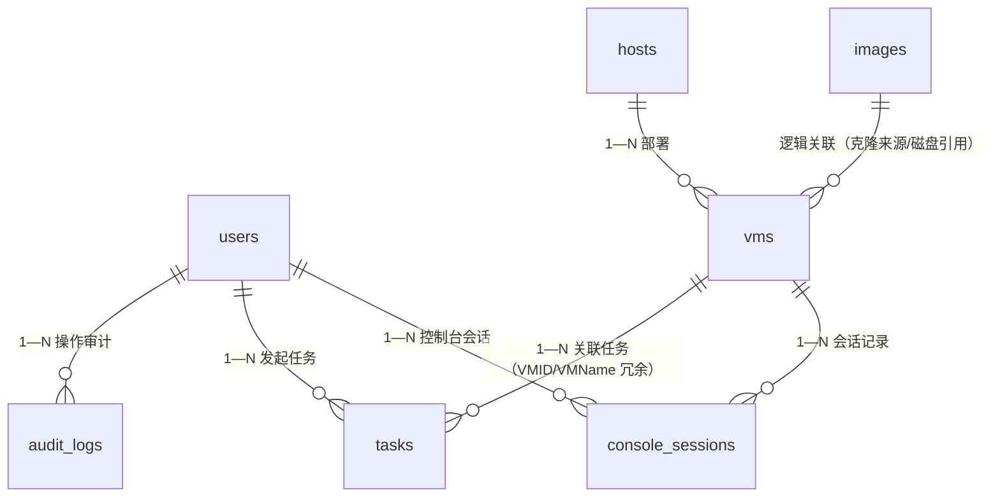

# 数据库设计

> 对应论文章节：第四章 总体设计（数据模型部分）。
> 素材来源：旧《数据库设计》全文、model/*.go 定义、database.Init() AutoMigrate。

[TOC]

------

## 1. 设计原则

- 7 张核心表覆盖 KVM 管理、异步任务与会话跟踪功能。
- 软删除（`DeletedAt`，任务表与会话表为运行记录、采用硬删除/终态标记而非软删除）、外键约束 + 级联、适当冗余（`username`、`vm_name` 便于列表展示）。
- 建表与种子数据不依赖手工 SQL（`AutoMigrate` + `initSeedData`）。
- 任务 `Payload` 内部使用、不返回前端；会话 `Token` 内部关联、不返回前端。

## 2. ER 图

## 3. 表结构

### 3.1 users 表

| 字段 | 类型 | 约束/说明 |
|---|---|---|
| id | uint | 主键 |
| username | varchar(50) | 唯一索引，非空 |
| password_hash | varchar(255) | bcrypt 哈希，不返回前端 |
| role | varchar(10) | `admin` / `viewer`，默认 `viewer` |
| is_active | bool | 默认启用 |
| real_name / phone / email | varchar | 展示信息 |
| last_login | datetime nullable | 登录时更新 |
| created_at / updated_at / deleted_at | 时间戳 | 软删除索引 |

种子账号：`admin/password`（admin）、`user/123456`（viewer）。

### 3.2 hosts 表

| 字段 | 说明 |
|---|---|
| name、libvirt_uri、ssh_ip、ssh_port、ssh_user | 连接信息 |
| status、cpu/mem/disk、os_version、description | 状态采集与描述 |

### 3.3 vms 表

| 字段 | 类型 | 约束/说明 |
|---|---|---|
| id | uint | 主键 |
| uuid | varchar(36) | 唯一索引（libvirt 域 UUID） |
| name | varchar(100) | 非空 |
| host_id | uint | 外键索引，关联 hosts |
| template | varchar(100) | 来源标记（如 `clone` / `image`） |
| storage_pool | varchar(100) | 默认 `vmops` |
| vcpu | int | 默认 1 |
| memory_mb | int | 默认 1024 |
| disk_gb | int | 默认 20（多盘累计） |
| ip | varchar(45) | 兼容 IPv6 长度 |
| mac_address | varchar(17) | 首网卡 MAC |
| status | varchar(20) | 默认 `shut off`，仅 `running / shut off / paused / error`（经 `StateToPlatform` 映射） |
| os_type | varchar(50) | 如 `hvm` |
| description | text | 描述 |
| created_at / updated_at / deleted_at | 时间戳 | 软删除索引 |

状态枚举与 virsh 状态映射（`running/shut off/paused/error`）由 virt 层统一转换，与 `vms.status` 一致。

### 3.4 images 表

| 字段 | 类型 | 约束/说明 |
|---|---|---|
| id | uint | 主键 |
| name | varchar(100) | 非空 |
| path | varchar(500) | 非空，卷落盘路径 |
| os_version | varchar(100) | 系统版本 |
| size_gb | float | 镜像大小 |
| format | varchar(20) | 默认 `qcow2` |
| is_template | bool | 默认 `false`；模板标记：`PUT /api/images/:id/template` 改写，`GET /api/images?is_template=true` 筛选，创建向导的云镜像选项即取模板 |
| description | text | 描述 |
| created_at / updated_at / deleted_at | 时间戳 | 软删除索引 |

### 3.5 audit_logs 表

| 字段 | 说明 |
|---|---|
| user_id（FK）、username（冗余） | 操作人 |
| action、object_type、object_id、detail | 操作类型/对象/详情 |
| source_ip、status | 来源与结果 |
| created_at | 记录时间 |

操作类型枚举覆盖登录、VM 生命周期、主机/镜像/存储/网络、暂停恢复、克隆、磁盘网卡挂卸、快照等（见仪表盘审计映射）。

### 3.6 tasks 表（异步任务记录）

对应 `model/task.go`，表名 `tasks`，无软删除（仅终态 `success/failed` 可经 `DELETE /api/tasks/:id` 清理）。

| 字段 | 类型 | 约束/说明 |
|---|---|---|
| id | uint | 主键 |
| type | varchar(50) | 索引；`create_vm / delete_vm / clone_vm / clone_image_vm / stop_vm` |
| title | varchar(200) | 如“创建虚拟机 smoke-01” |
| status | varchar(20) | 索引；`pending / running / success / failed` |
| progress | int | 默认 0，0–100，worker 经 `Report` 回写 |
| payload | text | 执行参数 JSON，内部使用，不返回前端 |
| result | text | 成功结果 JSON，如 `{"vm_id":123}` |
| error | varchar(500) | 失败中文原因（截断 500 rune） |
| user_id | uint nullable | 发起人 |
| username | varchar(100) | 发起人冗余 |
| vm_id | uint nullable | 关联 VM（成功后回填） |
| vm_name | varchar(100) | 关联 VM 名冗余 |
| created_at / updated_at | 时间戳 | 无软删除 |

### 3.7 console_sessions 表（控制台会话记录）

对应 `model/session.go`，表名 `console_sessions`，记录“谁在何时以何种方式连了哪台 VM”。

| 字段 | 类型 | 约束/说明 |
|---|---|---|
| id | uint | 主键 |
| vm_id | uint | 索引，关联 VM |
| vm_name | varchar(100) | 索引，冗余便于展示 |
| user_id | uint nullable | 连接用户 |
| username | varchar(100) | 用户名冗余 |
| type | varchar(20) | 索引；`vnc / ssh / serial` |
| client_ip | varchar(45) | 来源 IP |
| status | varchar(20) | 索引；`active / closed` |
| token | varchar(100) | VNC token 内部关联，不返回前端 |
| started_at | datetime | 会话开始 |
| last_seen | datetime | VNC token 最近一次被 websockify 解析（存活心跳） |
| ended_at | datetime nullable | 会话结束 |

收敛语义：SSH/串口走后端 WS 桥，关闭时回写 `ended_at`；VNC 走 websockify 中转、后端看不到断开事件，靠 `TouchByToken` 刷新 `last_seen` + 清扫器（超 60 分钟无解析标 `closed`）收敛。

## 4. GORM 模型定义

- `User / Host / VM / Image / AuditLog / Task / ConsoleSession` 七模型，`TableName()` 逐字指定表名（`users / hosts / vms / images / audit_logs / tasks / console_sessions`）。
- `database.Init()` 中 `AutoMigrate` 七模型自动建表；连接池 `MaxOpenConns=50、MaxIdleConns=10、ConnMaxLifetime=1h`。
- `main.go initSeedData` 在空库时创建 admin/viewer 种子账号。

## 5. 索引与约束

| 表 | 索引 |
|---|---|
| users | `username` 唯一索引、`deleted_at` 索引 |
| vms | `uuid` 唯一索引、`host_id` 索引、`deleted_at` 索引 |
| images | `deleted_at` 索引 |
| tasks | `type` 索引、`status` 索引 |
| console_sessions | `vm_id`、`vm_name`、`type`、`status` 索引 |
| audit_logs | `action`、`created_at` 等查询索引 |

---

## 📌 素材出处

- 旧《数据库设计》全文（表结构、字段说明、GORM 定义、种子逻辑）
- model/*.go（`task.go`、`session.go`、`vm.go`、`image.go`）、database/database.go、main.go initSeedData
