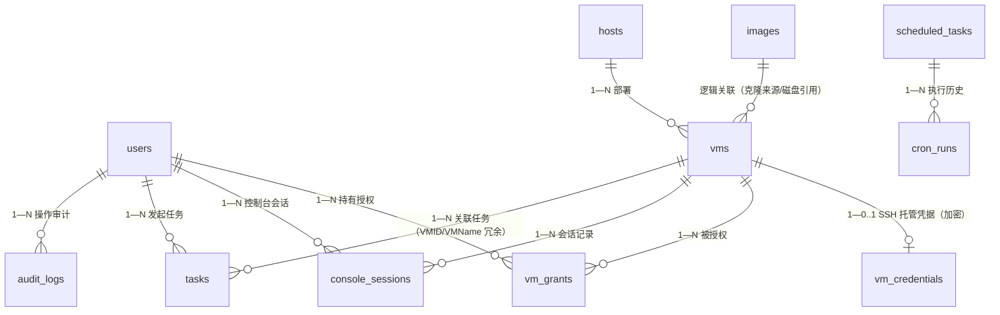

# 数据库设计

> 对应论文章节：第四章 总体设计（数据模型部分）。
> 素材来源：旧《数据库设计》全文、model/*.go 定义、database.Init() AutoMigrate。

[TOC]

------

## 1. 设计原则

- 16 张表覆盖 KVM 管理、异步任务、会话跟踪、运维闭环、资产授权与 v3 扩展能力（容器/应用商店/计划任务/凭据托管等）：核心 11 表（users/hosts/vms/images/audit_logs/tasks/console_sessions/system_settings/alerts/pool_meta/vm_grants）+ v3 新增 5 表（scheduled_tasks/cron_runs/vm_credentials/cloud_init_templates/host_keys）。Docker 容器、应用商店已装列表、SSH 主机进程等运行态数据**刻意不入库**——它们分别以 docker daemon、compose 项目目录与宿主机文件系统为准，平台只做代理查询，不维护第二份会过期失真的副本。
- 软删除（`DeletedAt`）仅用于**资产表**（vms/hosts/images/users）——资产有「删了但历史记录还想看名字」的诉求；过程表（tasks/audit_logs/console_sessions/cron_runs）为运行记录、采用硬删除/终态标记而非软删除。外键约束 + 级联、适当冗余（`audit_logs.username` 为刻意反范式：用户被删除后日志仍可读；`tasks.username`、`console_sessions.vm_name`、`cron_runs.task_name` 便于列表展示）。
- 建表与种子数据不依赖手工 SQL（`AutoMigrate` + `initSeedData`）。**已知取舍**：单机小数据量场景下 AutoMigrate 足够且零运维，生产化方向是引入版本化迁移工具（如 golang-migrate）获得可回放的 DDL 历史。
- 可空列一律用**指针类型**（`*time.Time` / `*uint`）：值类型零值会把「未发生」写成零日期/零 ID（如 `alerts.ends_at` firing 时不携带，值类型会写 MySQL 零日期，严格 SQL 模式下插入失败）。
- 索引按查询路径覆盖：状态筛选（status/type）、关联过滤（vm_id/host_id）、时间排序（created_at）均有对应索引。
- 连接池 `MaxOpenConns=50、MaxIdleConns=10、ConnMaxLifetime=1h`。
- 任务 `Payload` 内部使用、不返回前端；会话 `Token` 内部关联、不返回前端。

## 2. ER 图

> 其余四表为独立实体，不持外键：`system_settings` 是 KV 配置；`alerts` 以 Alertmanager 的
> fingerprint 关联外部监控栈；`pool_meta` 以池名（唯一索引）松关联 libvirt 池；`host_keys` 以
> (host, port) 关联 SSH 目标（虚拟机重建会换主机密钥，行独立于 vms 生命周期）。

## 3. 表结构

### 3.1 users 表

| 字段 | 类型 | 约束/说明 |
|---|---|---|
| id | uint | 主键 |
| username | varchar(50) | 唯一索引，非空 |
| password_hash | varchar(255) | bcrypt 哈希，不返回前端 |
| role | varchar(10) | `admin` / `operator` / `viewer`，默认 `viewer`。三级角色：`admin` 全权；`operator`（学生）可操作虚拟机全生命周期（含三类控制台），其余模块只读；`viewer`（教师）**完全只读**：读接口 + 图形控制台只读观看，变更操作与 SSH/串口控制台均 403。非 admin 用户对 VM 的可见范围另受 vm_grants 授权约束（见 3.11） |
| is_active | bool | 默认启用；置 false 后鉴权阶段即 403「账号已被禁用」 |
| real_name / phone / email | varchar | 展示信息 |
| last_login | datetime nullable | 登录时更新 |
| created_at / updated_at / deleted_at | 时间戳 | 软删除索引 |

种子账号：`admin/password`（admin）、`user/123456`（viewer）。明文口令不写入启动日志（只打用户名与角色），首次登录后应立即修改。

> `password_hash` 是本表最敏感的列。改造前带 `:id` 的查询接口把路径参数直传 ORM，攻击者可经内联条件退化出的原始 SQL 做布尔盲注读取该列（且只读角色即可达）；现路径参数主键统一解析为数值后才进入查询，见 docs/05 §6.11.1。

### 3.2 hosts 表

| 字段 | 说明 |
|---|---|
| name、ssh_ip、ssh_port、ssh_user | 登记信息。`ssh_ip` 写入前须过格式校验（IP 或保守主机名白名单）——该值会作为 argv 传给 `ping`，以连字符开头的取值会被当成命令选项，见 docs/05 §3 |
| status、cpu_cores/memory_gb、description | 状态采集与描述。`status` 取 `unknown / reachable / unreachable`，由连通性测试回写 |

> 定位是「宿主机登记与状态采集」：登记 SSH 信息用于连通性探测（ping）、关联 vms 做资源归属。早期版本曾在此放 `libvirt_uri` 字段冒充多宿主机纳管，因从未用于建立连接已移除（`os_version`、`disk_gb` 两个只占位不回写的死列先后清理）；虚拟化连接固定为本机 `qemu:///system`。

### 3.3 vms 表

| 字段 | 类型 | 约束/说明 |
|---|---|---|
| id | uint | 主键 |
| uuid | varchar(36) | 唯一索引（libvirt 域 UUID） |
| name | varchar(100) | 非空 |
| host_id | uint | 外键索引，关联 hosts |
| storage_pool | varchar(100) | 默认 `vmops`（列默认值；运行时创建未指定池时的兜底取 `default_storage_pool` 设置，当前为 `images`，见 3.8） |
| vcpu | int | 默认 1 |
| memory_mb | int | 默认 1024 |
| disk_gb | int | 默认 20（多盘累计） |
| ip | varchar(45) | 兼容 IPv6 长度；由 DHCP 租约 + qemu-guest-agent 双通道在列表/详情请求时自动回填（30s 节流），无手工编辑入口 |
| mac_address | varchar(17) | 首网卡 MAC |
| status | varchar(20) | 默认 `shut off`，仅 `running / shut off / paused / error`（经 `StateToPlatform` 映射） |
| os_type | varchar(50) | 如 `hvm` |
| description | text | 描述 |
| created_at / updated_at / deleted_at | 时间戳 | 软删除索引 |

状态枚举与 virsh 状态映射（`running/shut off/paused/error`）由 virt 层统一转换，与 `vms.status` 一致。

> `status` 列默认值曾与该映射不一致：模型里写作 `shut_off`（**下划线**），而 `StateToPlatform` 返回
> `shut off`（**空格**），前端亦按空格版本做颜色与文案映射——一旦某行落到列默认值，其状态在前端将匹配
> 不到任何已知状态。P2 已把默认值改为 `shut off`，并新增两套常量（`model.VMStatus*` 与 `virt.Status*`）
> 供各层引用，杜绝字面量散落（gorm tag 内不能引用常量，故该处字面量须与常量手工同步，代码注释已注明）。
> 存量数据核查确认库中**没有** `shut_off` 的历史行（所有写入路径都显式给出状态值，从未落到列默认值）；
> GORM `AutoMigrate` 可修改已有列的默认值，后端重启即收敛，无需手工 DDL。详见 docs/05 §6.12。

### 3.4 images 表

| 字段 | 类型 | 约束/说明 |
|---|---|---|
| id | uint | 主键 |
| name | varchar(100) | 非空 |
| path | varchar(500) | 非空，卷落盘路径。**该路径可能同时被虚拟机引用**：「基于云镜像创建」（`disks[].source_image_id`）是直接引用镜像文件、不做拷贝，因此删除虚拟机时必须以本表的 `path` 集合作为守卫，避免删掉镜像本体而留下悬挂记录（见 docs/05 §6.7.3） |
| os_version | varchar(100) | 系统版本 |
| size_gb | float | 镜像大小 |
| format | varchar(20) | 默认 `qcow2` |
| is_template | bool | 默认 `false`；模板标记：`PUT /api/images/:id/template` 改写，`GET /api/images?is_template=true` 筛选，创建向导的云镜像选项即取模板 |
| description | text | 描述 |
| created_at / updated_at / deleted_at | 时间戳 | 软删除索引 |

### 3.5 audit_logs 表

| 字段 | 说明 |
|---|---|
| user_id（FK）、username（冗余） | 操作人 |
| action、object_type、object_id、detail | 操作类型/对象/详情 |
| source_ip、status | 来源与结果 |
| created_at | 记录时间 |

操作类型枚举覆盖登录、VM 生命周期、主机/镜像/存储/网络、暂停恢复、克隆、磁盘网卡挂卸、快照等（见仪表盘审计映射）。

### 3.6 tasks 表（异步任务记录）

对应 `model/task.go`，表名 `tasks`，无软删除（仅终态 `success/failed` 可经 `DELETE /api/tasks/:id` 清理）。

| 字段 | 类型 | 约束/说明 |
|---|---|---|
| id | uint | 主键 |
| type | varchar(50) | 索引；`create_vm / delete_vm / clone_vm / clone_image_vm / stop_vm` |
| title | varchar(200) | 如“创建虚拟机 smoke-01” |
| status | varchar(20) | 索引；`pending / running / success / failed` |
| progress | int | 默认 0，0–100，worker 经 `Report` 回写 |
| payload | text | 执行参数 JSON，内部使用，不返回前端 |
| result | text | 成功结果 JSON。`create_vm`/`clone_vm`/`clone_image_vm` 为 `{"vm_id":123}`；`stop_vm`/`delete_vm` 为 `{"vm":"名称"}`；`delete_vm` 另可能带 `kept_volumes`（字符串数组，被守卫刻意保留的共享卷及中文原因，见 docs/task-contract.md） |
| error | varchar(500) | 失败中文原因（截断 500 rune）。该字段**会回显前端**，故只存用户可见文案，原始错误链、panic 值与调用栈一律只进服务端日志。固定文案：`任务执行异常，请查看服务日志`（executor 或 worker panic）、`任务队列繁忙，请稍后重试`（入队超时）、`任务参数损坏，无法执行`（payload 反序列化失败）、`服务重启，未完成任务已终止，请重新提交`（启动收敛） |
| user_id | uint nullable | 发起人 |
| username | varchar(100) | 发起人冗余 |
| vm_id | uint nullable | 索引；关联 VM（成功后回填），任务详情按 VM 过滤走该索引 |
| vm_name | varchar(100) | 关联 VM 名冗余 |
| created_at / updated_at | 时间戳 | 无软删除 |

### 3.7 console_sessions 表（控制台会话记录）

对应 `model/session.go`，表名 `console_sessions`，记录“谁在何时以何种方式连了哪台 VM”。

| 字段 | 类型 | 约束/说明 |
|---|---|---|
| id | uint | 主键 |
| vm_id | uint | 索引，关联 VM |
| vm_name | varchar(100) | 索引，冗余便于展示 |
| user_id | uint nullable | 连接用户 |
| username | varchar(100) | 用户名冗余 |
| type | varchar(20) | 索引；`vnc / ssh / serial` |
| client_ip | varchar(45) | 来源 IP |
| status | varchar(20) | 索引；`active / closed` |
| token | varchar(100) | VNC token 内部关联，不返回前端 |
| started_at | datetime | 会话开始 |
| last_seen | datetime | VNC token 最近一次被 websockify 解析（存活心跳） |
| ended_at | datetime nullable | 会话结束 |

收敛语义：SSH/串口走后端 WS 桥，关闭时回写 `ended_at`；VNC 走 websockify 中转、后端看不到断开事件，靠 `TouchByToken` 刷新 `last_seen` + 清扫器（超 60 分钟无解析标 `closed`）收敛。SSH/串口的 WS 连接由 `console.Registry` 以写入串行化的 `*console.Conn` 形式持有，管理员强制断开经 `CloseWithReason` 发送带中文原因的关闭帧后再关连接。

角色约束：`type` 为 `ssh` / `serial` 的会话只可能由 admin / operator 建立（只读角色 viewer 在中间件层即被 403 拦下）；`vnc` 会话三种角色都可能建立，但 viewer 的会话在客户端以 noVNC 只读模式加载。

### 3.8 system_settings 表（系统可写配置）

| 字段 | 类型 | 说明 |
|---|---|---|
| key | varchar(100) | 主键；白名单共 9 键：`default_storage_pool`（未指定池时的兜底池名，运行时兜底值 `images`）/ `vnc_token_ttl_min` / `vnc_stale_min` / `ai_base_url` / `ai_api_key`（服务端保存、永不下发前端）/ `ai_model` / `security_entrance`（登录安全入口口令，空=关闭）/ `password_min_length`（0=关闭密码策略）/ `announcement`（系统公告，≤2000 字符） |
| value | varchar(2000) | 配置值（写入前经 service/setting 校验；列宽取公告键的上界，AutoMigrate 重启时自动把旧 500 列加宽） |
| updated_at | datetime | 最近更新时间 |

收敛语义：与 config 包的环境变量静态配置互补——环境变量管「部署时确定」的项（数据库/JWT/端口），
system_settings 管「运行时可调」的项（经 `PUT /api/settings` 修改、保存即生效）。
消费方经包级 resolver 钩子实时读取，进程内缓存挡住高频查询（登录页公告等匿名高频读因此不落库查询）。

### 3.9 alerts 表（告警历史，监控闭环批次新增）

对应 `model/alert.go`，表名 `alerts`。Alertmanager webhook 推回的告警按 fingerprint 去重入库，
firing/resolved 覆盖式更新同一行，供「监控中心 → 告警历史」追溯查询（与实时告警列表互补：
平台重启/AM 环形截断后实时列表查不到的告警，这里仍有记录）。

| 字段 | 类型 | 说明 |
|---|---|---|
| id | uint | 主键 |
| fingerprint | varchar(64) | 唯一索引；Alertmanager 对同一标签组合算出的稳定指纹，去重主键 |
| labels / annotations | text | 原始 JSON 文本（结构随规则变化，不建强类型列），查询时反序列化 |
| status | varchar(20) | `firing / resolved` |
| starts_at / ends_at | datetime | 告警开始/恢复时间。`ends_at` 必须用**指针**——firing 告警不携带该字段，值类型零值会写成 MySQL 零日期，严格 SQL 模式（NO_ZERO_DATE）下直接插入失败（实测 Error 1292） |
| created_at / updated_at | 时间戳 | 入库与最近更新 |

后台另有告警保留期清理任务，防止表无限增长。

### 3.10 pool_meta 表（存储池平台侧元数据，存储板块批次新增）

对应 `model/pool_meta.go`，表名 `pool_meta`。libvirt 池 XML 没有 description/role 字段，
池的「角色」（模板基盘/系统盘/数据盘等）与描述只能由平台自己存。

| 字段 | 类型 | 说明 |
|---|---|---|
| id | uint | 主键 |
| pool_name | varchar(64) | 唯一索引，关联 libvirt 池名 |
| role | varchar(20) | 空串 = 跟随自动推断（`handler.inferPoolRole` 按名称/路径推断，如 base→模板基盘） |
| description | varchar(500) | 池描述 |
| created_at / updated_at | 时间戳 | |

经 `PUT /api/storage/pools/:name/meta` 维护，存储池列表响应带 `pool_roles`。

### 3.11 vm_grants 表（VM 资产授权，借鉴堡垒机 JumpServer 4A）

对应 `model/vm_grant.go`，表名 `vm_grants`。一行 = 「把某台 VM 授给某个用户」；用户可见/可操作的
VM = 其有效授权的并集。核心语义是**授权决定可见性**：非 admin 访问任何 VM（列表/详情/规格/克隆源/
快照/三控制台/历史曲线）都要求存在未过期授权，未授权一律 404「查无此项」而非 403——不向无权用户
暴露资产的存在性；admin 不受约束。

| 字段 | 类型 | 约束/说明 |
|---|---|---|
| id | uint | 主键 |
| user_id | uint | 非空；与 vm_id 组成唯一索引 `idx_grant_user_vm`（priority 1） |
| vm_id | uint | 非空；单列索引 + 唯一索引 `idx_grant_user_vm`（priority 2） |
| expires_at | datetime nullable | NULL = 长期有效；到期在**查询判定时**即时视为不存在（软回收，无需清扫协程，行保留可查授权历史） |
| granted_by | uint | 授权人（admin 用户 ID） |
| created_at | 时间戳 | 授予时间 |

生命周期自动化：建机/克隆任务成功后自动给发起人授一条长期授权（`execCreateVM` / `execCloneVM` /
`execCloneImageVM`）；删 VM 时回收该 VM 的全部授权（`execDeleteVM`）。

API（admin 专用，handler 内 `requireAdminRole` 二次收口——路由前缀在 `/api/vms` 下，
OperatorMiddleware 会对 operator 放行该前缀写操作，故授权管理须再收一道）：`GET /api/vms/:id/grants`、
`POST /api/vms/:id/grants`（body `{user_id, expires_at?}`；(user_id, vm_id) 已存在则更新有效期，
过去时间返回 400）、`DELETE /api/vms/:id/grants/:gid`。

### 3.12 scheduled_tasks 表（计划任务定义，v3 新增）

对应 `model/scheduled_task.go`，表名 `scheduled_tasks`。一行 = 一条「按 cron 表达式定时执行的动作」，
调度器在 `service/cron`（每分钟 tick + 表达式匹配），本表只存定义与执行统计。

| 字段 | 类型 | 约束/说明 |
|---|---|---|
| id | uint | 主键 |
| name | varchar(100) | 任务名（展示用） |
| cron_expr | varchar(50) | 5 字段 cron 表达式（分 时 日 月 周），经 `cron.ParseCron` 校验后才允许入库 |
| action | varchar(50) | 动作白名单：`vm_snapshot`（定时对指定 VM 打快照）/ `db_backup`（定时 mysqldump） |
| params | varchar(500) | JSON 参数：`vm_snapshot` → `{"vm_id":14}`；`db_backup` → `{}` |
| enabled | bool | 默认 `true`；关闭后调度器跳过 |
| keep | int | 默认 7；保留最近 N 份产物（`cron-` 前缀快照数 / 备份文件数），清理只针对该前缀，手工快照不受影响 |
| last_run | datetime nullable | 最近一次执行时间（含手动触发；指针类型，nil = 从未执行） |
| run_count | int | 累计执行次数（成功失败都计） |
| created_at / updated_at | 时间戳 | |

设计要点：执行**历史**另落 `cron_runs` 表（见 3.13），本表 `last_run`/`run_count` 只做列表页概览；
`keep` 的清理按产物名前缀判定而非全池清点，保证与用户手工快照互不干扰。

### 3.13 cron_runs 表（计划任务执行历史，v3 新增）

对应 `model/cron_run.go`，表名 `cron_runs`。每次执行（定时命中或手动触发）在开始时插一行 `running`，
结束时回写 `status` 与 `output` 摘要——失败排障与「最近执行了什么」都查这里。

| 字段 | 类型 | 约束/说明 |
|---|---|---|
| id | uint | 主键 |
| task_id | uint | 索引，所属 `scheduled_tasks.id` |
| task_name | varchar(100) | 任务名快照（**刻意冗余**：任务被删除后历史行保留仍可读） |
| started_at / finished_at | datetime | `finished_at` 为指针——nil 表示执行中，或进程中断未回写（`running` 行残留即执行中断的痕迹） |
| status | varchar(20) | 索引；`running / success / failed`（常量 `model.CronRunStatus*`） |
| output | text | 结果摘要：成功为成果描述、失败为错误摘要（≤2000 字符，超出截断） |

设计要点：无软删除、不级联删除——删计划任务时历史行保留（审计口径与 `audit_logs.username` 冗余一致）；
`running` 残留行不被自动改写，是「进程重启时执行被打断」的真实证据。

### 3.14 vm_credentials 表（SSH 凭据托管，v3 新增）

对应 `model/vm_credential.go`，表名 `vm_credentials`。一台 VM 至多一条凭据（`vm_id` 唯一索引，
重复保存 = 覆盖更新），供文件管理/应用商店的 `use_saved` 通道在服务端内部取用，免去每次重输口令。

| 字段 | 类型 | 约束/说明 |
|---|---|---|
| id | uint | 主键 |
| vm_id | uint | **唯一索引**；VM 软删后本行成为无害孤儿（不可达，无悬挂引用语义） |
| user | varchar(50) | SSH 登录用户名（如 root / ubuntu） |
| port | int | 默认 22 |
| password_enc | varchar(500) | **AES-256-GCM 密文**（base64，随机 nonce 前置）；密钥 = SHA-256(主密钥‖盐) 派生，主密钥来自运行时注入、不落库。json tag 为 `-`，模型即使被直接序列化也不会泄露密文 |
| salt | varchar(64) | 密钥派生盐（32 字节随机数的 hex），每次保存重新生成——同明文两次加密密文不同；json tag 同样为 `-` |
| created_at / updated_at | 时间戳 | |

设计要点：**防的是「数据库泄露后凭据直接可读」**，不防「应用进程与数据库同时失守」（主密钥在进程
内存里属主机沦陷场景，任何应用层加密都无解，不宣称更强保证）；解密只发生在服务端，前端只拿到掩码；
主密钥轮换（含 JWT_SECRET 更换）会使旧密文失效——设计上接受，重新保存即可。加密实现在
`service/secretbox`（标准库 AES-GCM，零第三方依赖）。

### 3.15 cloud_init_templates 表（cloud-init 配置模板，v3 新增）

对应 `model/cloud_init_template.go`，表名 `cloud_init_templates`。一份「创建虚拟机时 cloud-init
参数（主机名/用户/口令/SSH 公钥/网络模式等）」的可复用预设，创建向导一键套用。

| 字段 | 类型 | 约束/说明 |
|---|---|---|
| id | uint | 主键 |
| name | varchar(100) | 唯一索引 |
| spec | text | JSON 序列化的 `virt.CloudInitSpec`。**刻意以 JSON 字符串松耦合**：virt 层不 import model（避免把 GORM 拖进最底层封装层），故结构体定义在 virt、序列化存储在 model，反序列化在 handler 完成；`json:"-"` 不直接外泄原文，对外经 DTO 以对象返回 |
| description | varchar(500) | 描述 |
| created_at / updated_at | 时间戳 | |

### 3.16 host_keys 表（SSH 主机密钥 TOFU 指纹，v3.3 新增）

对应 `model/host_key.go`，表名 `host_keys`。SSH 主机密钥 **TOFU（Trust On First Use）** 校验的存储：
首次连上某 host:port 时记录服务器公钥的 SHA256 指纹（等价 openssh 客户端写 known_hosts），后续连接
逐一比对，指纹不一致即拒绝——防中间人在 SSH 认证发生前替换对端。Web 终端（`handler/terminal.go`）
与 VM 文件管理/应用安装（`service/vmssh`）两条 SSH 通道共用同一张表。

| 字段 | 类型 | 约束/说明 |
|---|---|---|
| id | uint | 主键 |
| host | varchar(255) | 非空；与 port 组成唯一索引 `idx_host_key_host_port`（同机不同端口是两条记录，各自独立信任） |
| port | int | 非空 |
| key_type | varchar(50) | 公钥算法名（如 `ssh-ed25519`） |
| fingerprint | varchar(100) | `SHA256:<base64>`（`ssh.FingerprintSHA256` 格式，与 `ssh-keygen -lf` 一致） |
| created_at | datetime | 首次连接（信任建立）时间 |

设计要点：存储经 `vmssh.HostKeyStore` 接口抽象，gorm 为默认实现、单测用内存 map 替换；DB 故障时
回调 **fail-closed**（查不到记录状态即拒绝连接，绝不退化成不校验）。虚拟机重建会换主机密钥，此时由
管理员删除旧指纹记录放行重录（`DELETE /api/ssh-host-keys/:id`，仅 admin），错误文案直接引导该动作。

## 4. GORM 模型定义

- `User / Host / VM / Image / AuditLog / Task / ConsoleSession / Setting / Alert / PoolMeta / VMGrant / ScheduledTask / CronRun / VMCredential / CloudInitTemplate / HostKey` 十六模型，`TableName()` 逐字指定表名（`users / hosts / vms / images / audit_logs / tasks / console_sessions / system_settings / alerts / pool_meta / vm_grants / scheduled_tasks / cron_runs / vm_credentials / cloud_init_templates / host_keys`）。
- `database.Init()` 中 `AutoMigrate` 十六模型自动建表（AutoMigrate 只加列不改删列，已删字段残留的物理列无害）；连接池 `MaxOpenConns=50、MaxIdleConns=10、ConnMaxLifetime=1h`。
- `main.go initSeedData` 在空库时创建 admin/viewer 种子账号；`Count`/`HashPassword`/`Create` 任一失败即打日志中止，避免写入空哈希造成账号静默不可登录，明文口令不进日志。

## 5. 索引与约束

| 表 | 索引 |
|---|---|
| users | `username` 唯一索引、`deleted_at` 索引 |
| vms | `uuid` 唯一索引、`host_id` 索引、`deleted_at` 索引 |
| images | `deleted_at` 索引 |
| tasks | `type` 索引、`status` 索引、`vm_id` 索引（任务按 VM 过滤） |
| console_sessions | `vm_id`、`vm_name`、`type`、`status` 索引 |
| audit_logs | `action`、`created_at` 等查询索引 |
| alerts | `fingerprint` 唯一索引 |
| pool_meta | `pool_name` 唯一索引 |
| vm_grants | `vm_id` 单列索引、`(user_id, vm_id)` 唯一索引 `idx_grant_user_vm` |
| scheduled_tasks | 无二级索引（量级 = 人工配置的计划任务数，主键足够） |
| cron_runs | `task_id` 索引、`status` 索引（执行历史按任务/状态过滤） |
| vm_credentials | `vm_id` 唯一索引（一台 VM 至多一条凭据） |
| cloud_init_templates | `name` 唯一索引 |
| host_keys | `(host, port)` 唯一索引 `idx_host_key_host_port`（同机不同端口各自独立信任） |

---

## 📌 素材出处

- 旧《数据库设计》全文（表结构、字段说明、GORM 定义、种子逻辑）
- model/*.go（`task.go`、`session.go`、`vm.go`、`image.go`、`vm_grant.go`、`scheduled_task.go`、`cron_run.go`、`vm_credential.go`、`cloud_init_template.go`、`host_key.go`）、database/database.go、main.go initSeedData
- service/secretbox（凭据加密）、service/vmssh/hostkey.go（TOFU 指纹回调）、service/cron（计划任务语义）
