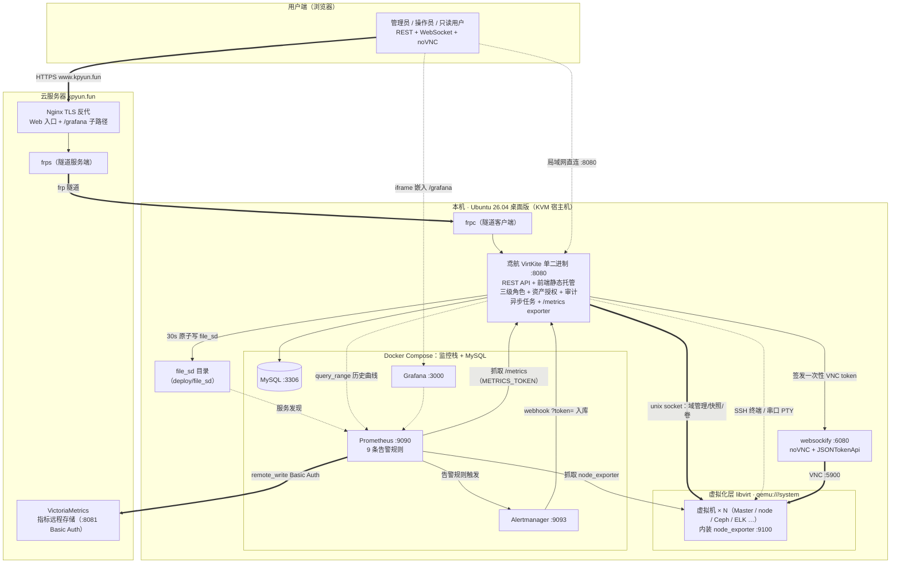

# 系统架构图

> 整体部署形态：本机 Ubuntu 26.04（KVM 宿主机）运行平台与监控栈，云服务器 kpyun.fun 经 frp 隧道提供公网访问与远程指标存储。

## 层次说明

| 层 | 组件 | 职责 |
|---|---|---|
| 用户端 | 浏览器 | 三角色访问 REST API / WebSocket 终端 / noVNC 控制台 |
| 云服务器 | Nginx TLS + frps + VictoriaMetrics | 公网入口与隧道中转；业务指标远程长存 |
| 平台层 | 鸢航 VirtKite 单二进制 | API、静态前端、任务系统、授权审计、内建 exporter |
| 控制台链路 | websockify + noVNC | 一次性 token 换 VNC 连接 |
| 虚拟化层 | libvirt / qemu | 15 台虚拟机的真实生命周期 |
| 监控栈 | Prometheus / Alertmanager / Grafana | 指标采集、告警、看板；历史曲线以 Prometheus 为库 |
